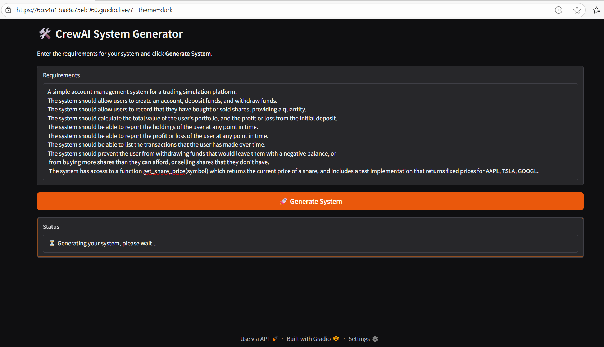

# CrewAI Modular System Generator

A production-ready template for generating complete Python systems with **CrewAI**, using a **Gradio UI**.  
The app takes your natural-language requirements, produces a **structured multi‑module design**, then builds:
- One or more **backend modules** (pure Python)
- A minimal **Gradio demo app** (`app.py`)
- (Optionally) **unit tests** per module

All artifacts are written to the `output/` folder.

---

## ✨ Features

- **Interactive UI** (Gradio): paste requirements → click **Generate System**.
- **Structured planning**: the engineering lead returns **JSON** describing modules/classes.
- **Dynamic task creation**: code/test/frontend tasks are created at runtime from the plan.
- **Safe code execution**: backend/test agents use Docker sandbox (`code_execution_mode="safe"`).
- **Resilient runs**: frontend creation is decoupled from tests so UI appears even if tests fail.
- **Deterministic prompts**: low temperature for consistent JSON / code outputs.

---

## 📷 Sample Interface Screenshot




---

## 🚀 Quickstart

### 1) Requirements
- **Python** 3.10–3.12  
- **Docker** running (required for agents with `code_execution_mode="safe"`)  
- **API keys** (put them in a `.env` at the project root):
  - `OPENAI_API_KEY=...`
  - *(optional)* `ANTHROPIC_API_KEY=...`


### 2) Setup
```bash
git clone https://github.com/vasiliskou/crewai-system-generator
cd crewai-system-generator

# Install uv and create the virtual env from pyproject.toml
pip install -U uv
uv sync
```

### 3) Run the UI
```bash
cd src/engineering_team
uv run run_crew --share
```

## 🧠 How It Works

### Phase 1 — Design
- The **engineering_lead** agent reads your requirements and returns **valid JSON** that matches the `DesignPlan` schema:
  ```json
  {
    "system_name": "str",
    "modules": [
      {
        "module_name": "str (ends with .py)",
        "classes": [{"class_name": "str", "summary": "str"}],
        "notes": "str"
      }
    ]
  }
  ```


### Phase 2 — Build
- `crew.py` dynamically creates tasks from the plan:
  - **Per-module code tasks** (backend modules).
  - **Frontend task** to produce `output/app.py` that imports all modules.
  - **Per-module test tasks** (best effort).
- The launcher runs these in **two/three sub-phases**:
  1. **Code** (must succeed)
  2. **Frontend** (runs even if tests fail)
  3. **Tests** (best-effort; failure won’t block success)

The UI finally reports either:
- ✅ “The system has been generated successfully.”
- ⚠️ “Generated but some files are missing.”
- ❌ Detailed error (and full traceback in the terminal).

---
